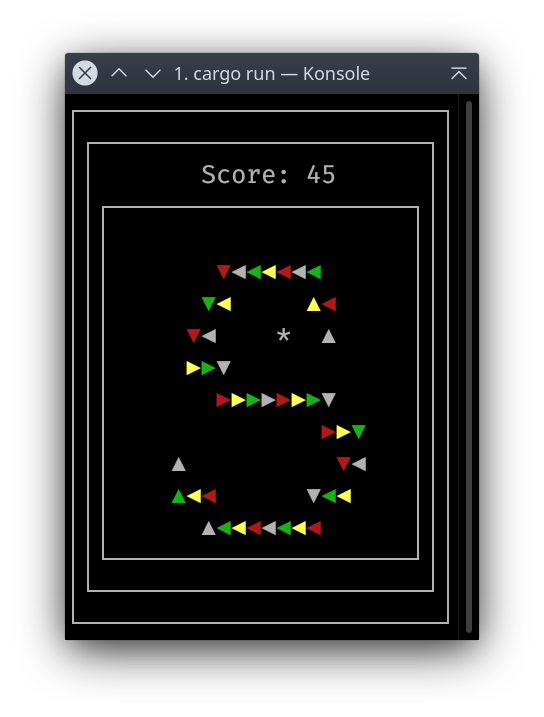

# Snake

Classic snake game, clone of the famous Nokia game, implemented in Rust programming language.

Project workspace is split in two packages: core functionality as a library, and terminal user interface based on pancurses.

# Eat some food

`$ cargo run`

Use keyboard arrows to control the snake, Q to quit.
